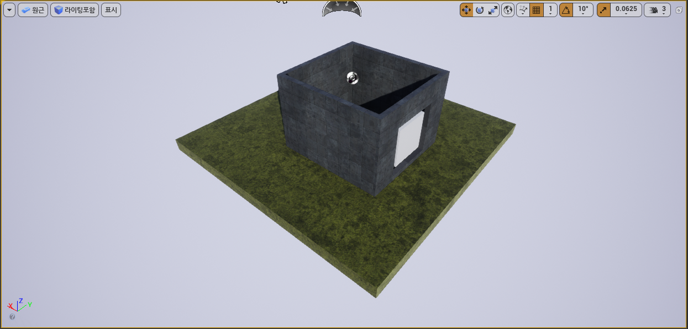
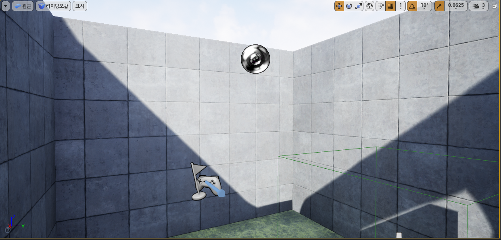
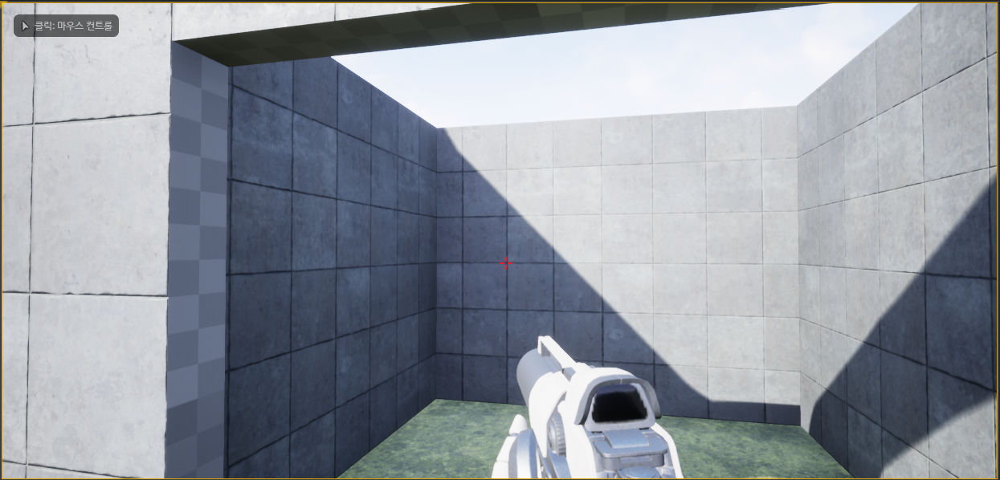
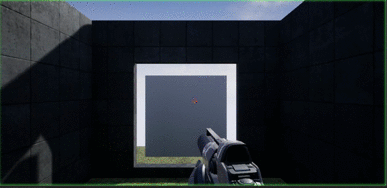

# Escape
Learn **blueprint** and **Unreal Engine** tools while making the escape room 
(Preference : https://www.youtube.com/channel/UCtZYp2-9HeNzaxDbuyzT2yg) 
 

2020 / 02 / 26  
I studied basically about Unreal Engine and placing box brushes.  
So I plated box brushes with material offering from Unreal Engine.  
And I found shortcut key End. End key exactly can place objects on floor.  

2020 / 02 / 27 
Following yesterday, I studied to make a door that applied particle effects. 
When the player stands at the door, the door disappears as it occured particle effect.  
 
To disappear the door, I used Set Actor Location method. 
Also to occur particle effect, I used Spawn Emitter at Location method in level blueprint.
<a href="https://docs.unrealengine.com/en-US/BlueprintAPI/Effects/Components/ParticleSystem/SpawnEmitteratLocation/index.html" 
>Spawn Emitter at Location</a>

<a href="https://docs.unrealengine.com/en-US/API/Runtime/Engine/GameFramework/AActor/SetActorLocation/index.html">Set Actor Location</a>
